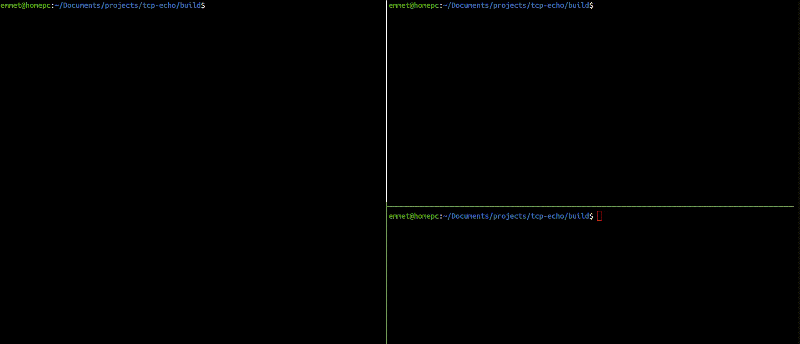

# Synchronous TCP/IP Echo Server in C

This project is a synchronous TCP/IP echo server wrote in C which supports multiple clients. The client sends a message to the server and the server echos back the message to the client. The maximum amount of clients allowed to communicate with the server is defined in ```MAX_FDS``` (max file descriptors)

The synchronous I/O functionality was implemented using the functions in the select library. The server handles each client using file descriptors. Each client will have their own file descriptor which describes their socket address structure and each one is stored in ```fd_set``` on the server to keep track of the connections. 
<br>
The server will continously loop around ```fd_set``` to handle new and existing client connections. <br><br>

**Adding new clients to the server:** If the file descriptor being ready to be read in is the same as the master socket then it signifies that a new client is connecting to the server and so the new client will be added to ```fd_set```<br>
**Handling existing clients:** If the file descriptor being ready to be read in is not the same as the master socket then the server will handle the existing client within ```fd_set``` <br>
**Removing clients:** If the return value from the received client is zero, then the server will close the client socket and remove their file descriptor from ```fd_set```

## Build

```bash
git clone https://github.com/efriel94/tcp-echo.git
cd tcp-echo
mkdir build && cd build && cmake ..
make
```

## Usage

Run server first:
```bash
./server <port>
```

Clients:
```bash
./client <server-address> <server-port>
```

## Demo 
