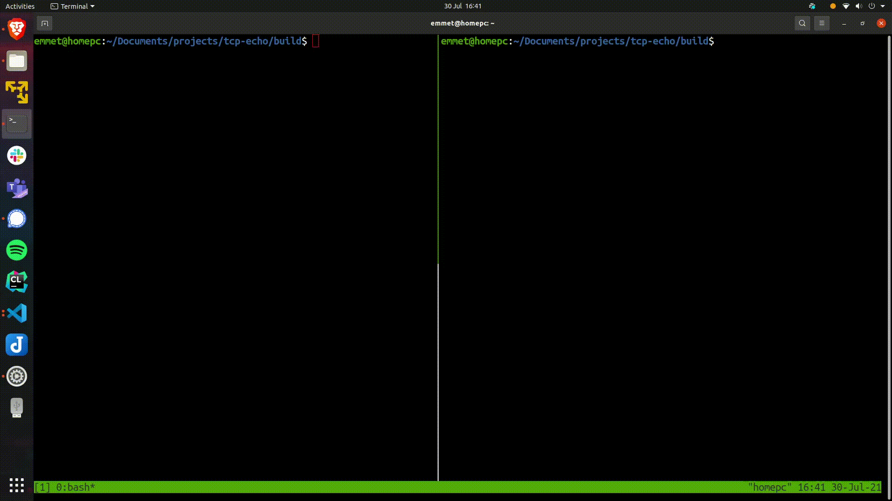

# TCP/IP Echo Server in C

This project is a TCP/IP echo server wrote in C. The client sends a message to the server and the server echos back the message to the client.

Note: At the moment only a maximum of one client can communicate and connect to the server. This will be updated in the future to allow a greater number

## Build

```bash
git clone https://github.com/efriel94/tcp-echo.git
cd tcp-echo
mkdir build && cd build && cmake ..
make
```

## Usage

Run server first:
```bash
./server <port>
```

Client:
```bash
./client <server-address> <port>
```

## Demo 
